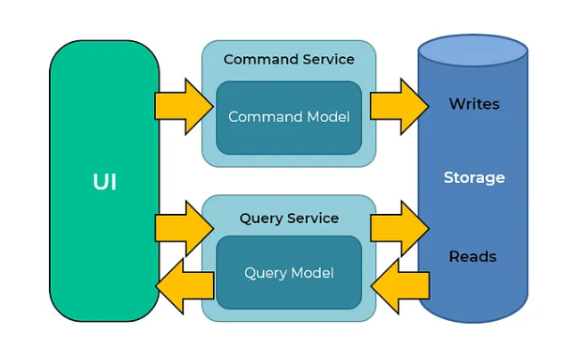

# CQRS (Command Query Responsibility Segregation) 
- CQRS, temel olarak yazma (write) ve okuma (read) işlemlerinin sorumluluklarını birbirinden ayırmaya odaklanan bir mimari tasarım modelidir.
- CQRS temel prensibi, bir metodun ya objenin durumunu değiştirmesi ya da bir sonuç döndürmesi gerektiğini belirtir; ancak her iki işlemi aynı anda yapmamalıdır

- Bu yaklaşımda metotlar 2 farklı modele ayrılmalıdır:

###  Commands: Objenin veya sistemin durumunu değiştirir.
Yeni bir veri eklemek ya da var olan veri üzerinde güncelleme yapmak için kullanılır. Örnek vermek gerekirse; Insert, Update, Delete. Geriye veri döndürmez.

###  Queries: Sadece sonucu geriye döner herhangi bir objenin veya sistemin durumunu değiştirmez.
 
Veritabanından veri almak için kullanılır. Geriye sadece belirtilen modeli döner ve veri üzerinde herhangi bir değişiklik yapmaz. Oluşturacağımız Query’lerimiz genellikle ‘Get’ ön eki ile isimlendirilir.

 

## CQRS Ne Zaman Kullanılmalı ?
- Birbirinden ayrı sistemlerde olası bir servisin hata vermesi durumunda bu hatanın sistemin akışına olumsuz yönde etkisi olmuyorsa kullanılabilir.
- Kompleks iş kurallarının olabileceği veya iş kurallarının sık sık değiştiği yapılarda kullanılabilir.
- Yüksek veri trafiğinin olduğu sistemlerde kullanılabilir.

## CQRS’in Avantajları
- Read ve write operasyonlarının ayrılması performansı, ölçeklenebilirliği ve güvenliği artırmaya yardımcı olabilir.
- Read ve write işlemleriniz için farklı veritabanları kullanılabilir.(Örneğin, yazma işlemleri için MySQL kullanırken okuma işlemleri için Couchbase ).

-Sorumlulukları birbirinden ayırarak SOLID prensiplerine uyum sağlanır.
 
## CQRS’in Dezavantajları
- Kod karmaşıklığını arttırır.
- Genellikle daha fazla altyapı ve araç gerektirir.

## CLASS Tanımlamaları:
### 1-  Commands
- Her bir Command türü için ayrı model tanımlanır. 
- İşleyiciye (Handler) iletilecek olan veriyi taşır

### 2-  Queries

- Command sınıfına benzer şekilde, işleyiciye iletilecek olan sorgu parametrelerini taşır

### 3-Handler 
- Command veya Query sınıfı ile iletilen işlemi gerçekleştiren sınıftır.
- İş mantığı burada uygulanır.
- Command için bir yazma işlemini (örneğin, veritabanına kaydetme) gerçekleştirir.
- Query için bir okuma işlemini (örneğin, bir veritabanından veri getirme) gerçekleştirir.
- İş mantığını Command veya Query sınıfından ayırmak içindir. 
- Single Responsibility Principle (SRP) prensibine uygunluk sağlar

### 4-Result
- **Yalnızca Sorgu sonuçlarını** döndürmek için bir veri modeli sağlar.
- Query'den dönen sonuçları taşır.

## Kaynakça
[Sefik Can Kanber - medium.com/CQRS (Command Query Responsibility Segregation) Nedir?](https://sefikcankanber.medium.com/cqrs-command-query-responsibility-segregation-nedir-16b196376389)

