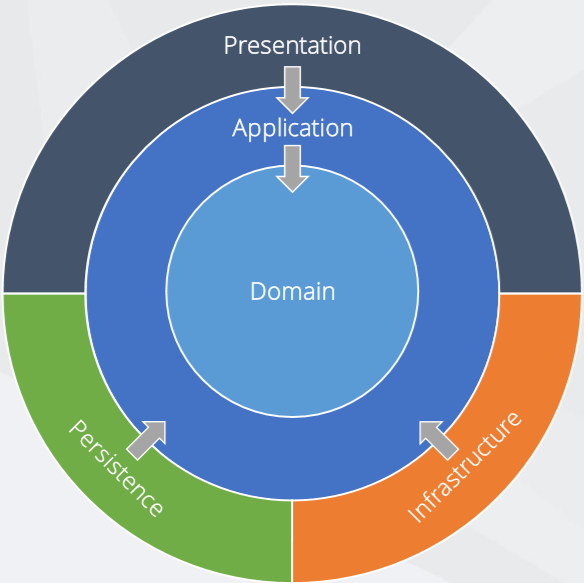

# Onion Architecture
- Soðan Mimarisi (Onion Architecture), yazýlým projelerinde katmanlý bir yaklaþým sunan bir mimari tasarým paradigmasýdýr. 2008 yýlýnda Jeffrey Palermo tarafýndan tasarlanmýþtýr. Bu mimarinin en temel özelliði baðýmlýlýðýn, dýþarýdan içeri doðru katmanlar halinde sýralanmasýdýr.
- Soðan Mimarisi, geleneksel katmanlý mimariden (örn: N-TIER ARCH) bazý önemli yönlerden farklýdýr.
**Baðýmlýlýk yönü**: Katmanlý mimaride, her katman hem iç hem de dýþ katmanlara baðlý olabilir. Bu, katmanlar arasý daha güçlü bir baðlanma oluþturur ve katmanlarýn birbirinden baðýmsýz olarak geliþtirilmesini ve test edilmesini zorlaþtýrabilir. Soðan Mimarisi’nde ise her katman yalnýzca iç katmanlara baðlýdýr, bu da gevþek bir baðlanma ve daha fazla baðýmsýzlýk saðlar.
 
 
 **Veri katmaný konumu**: Katmanlý mimaride, veri katmaný genellikle en iç katmandýr. Soðan Mimarisi’nde ise veri katmaný en dýþ katmandýr. Bu, veriye eriþimin farklý katmanlardan soyutlanmasýný ve uygulamanýn farklý veri kaynaklarýyla kolayca deðiþtirilmesini saðlar.
 
 **Odak noktasý:** Katmanlý mimari, genellikle iþlevselliðe odaklanýrken, Soðan Mimarisi domain modeline odaklanýr. Bu, domain modelinin daha net ve merkezi bir rol oynamasýný ve uygulamanýn temel iþlevlerinin daha iyi anlaþýlmasýný saðlar.

 

**Çekirdek Katmaný (Core Layer):** Uygulamanýn en temel iþlevlerini içeren en iç katmandýr. Bu katmanda, domain nesneleri, arabirimler ve servisler gibi uygulamaya özgü öðeler bulunur. Çekirdek katmaný, diðer katmanlardan baðýmsýzdýr ve herhangi bir dýþ kaynaða veya çerçeveye baðlý deðildir.

**Depo Katmaný (Repository Layer):** Çekirdek katmaný ile veri eriþimi katmaný arasýnda bir soyutlama katmaný görevi görür. Bu katmanda, veri tabanýna veya diðer veri kaynaklarýna eriþimi saðlayan arabirimler ve somut sýnýflar bulunur. Depo katmaný, çekirdek katmanýna veri modelleri aracýlýðýyla veri saðlar ve çekirdek katmanýnýn veri eriþiminin nasýl gerçekleþtiðine dair ayrýntýlarý gizler.

**Uygulama Katmaný (Application Layer):** Çekirdek katmanýnýn iþlevlerini kullanarak iþ mantýðýný uygular. Bu katmanda, use case’ler, iþ akýþlarý ve kurallar gibi uygulamaya özgü mantýk bulunur. Uygulama katmaný, çekirdek katmanýna ve depo katmanýna baðlýdýr, ancak diðer katmanlardan baðýmsýzdýr.

**Sunum Katmaný (Presentation Layer):** Uygulamanýn kullanýcý arayüzünü (UI) ve kullanýcý etkileþimini ele alýr. Bu katmanda, denetleyiciler, görünümler ve rotalar gibi UI öðeleri bulunur. Sunum katmaný, uygulama katmanýna baðlýdýr, ancak diðer katmanlardan baðýmsýzdýr.

**Altyapý Katmaný (Infrastructure Layer):** Uygulamanýn çalýþmasý için gerekli olan temel altyapý hizmetlerini saðlar. Bu katmanda, güncelleme, að, mesajlaþma ve günlük gibi hizmetler bulunur. Altyapý katmaný, diðer tüm katmanlardan baðýmsýzdýr.

**Soðan Mimarisi’nin temel prensipleri þunlardýr:**
- **Baðýmlýlýk ters çevirme:** Her katman, kendinden daha içteki katmanlara baðlýdýr. Bu, katmanlar arasý gevþek bir baðýmlýlýk (Loosely Coupled) oluþturur ve katmanlarýn birbirinden baðýmsýz olarak geliþtirilmesine ve test edilmesine olanak tanýr.
- **Soyutlama:** Her katman, diðer katmanlardan soyutlanmýþ bir þekilde tasarlanýr. Bu, katmanlar arasý güçlü bir baðlanma oluþturmayý önler ve kodun yeniden kullanýlabilirliðini ve sürdürülebilirliðini artýrýr.
- **Tek bir sorumluluk ilkesi:** Her katmanýn tek bir sorumluluðu olmalýdýr. Bu, kodun daha modüler ve anlaþýlýr olmasýný saðlar ve deðiþikliklerin yapýlmasýný kolaylaþtýrýr

**Soðan Mimarisi’nin faydalarý þunlardýr:**

- **Artan esneklik:** Katmanlar arasýndaki gevþek baðýmlýlýk, uygulamanýn yeni özelliklerle kolayca geniþletilmesini ve mevcut iþlevlerin deðiþtirilmesini saðlar.

- **Geliþtirilmiþ test edilebilirlik:** Her katman baðýmsýz olarak test edilebilir, bu da birim testlerinin yazýlmasýný ve hata ayýklamasýný kolaylaþtýrýr.

- **Artan sürdürülebilirlik:** Kodun modüler yapýsý, kodun anlaþýlmasýný ve bakýmýný kolaylaþtýrýr.

- **Daha az hata:** Katmanlar arasýndaki güçlü baðlanma eksikliði, hatalarýn bir katmandan diðerine yayýlmasýný önler.

**Soðan Mimarisi’nin bazý dezavantajlarý þunlardýr:**

- **Karmaþýklýk:** Katmanlar arasýndaki baðýmlýlýklar, özellikle büyük ve karmaþýk projelerde uygulamayý anlamak ve yönetmek zorlaþtýrabilir.
- **Test zorluðu:** Katmanlar arasýndaki entegrasyonu test etmek, birim testlerinden daha karmaþýk olan entegrasyon testlerini gerektirir.
- **Performans:** Birçok katmandan geçmek, uygulama performansýný olumsuz etkileyebilir.

- **Aþýrý soyutlama:** Soyutlamaya aþýrý odaklanmak, kodun gereksiz yere karmaþýk hale gelmesine neden olabilir.

## Kaynakça
[Cengiz Akarsu - medium.com/Nedir bu Onion Architecture?](https://cengizakarsu.medium.com/nedir-bu-onion-architecture-soðan-mimarisi-5b3e5e08f0ce)

